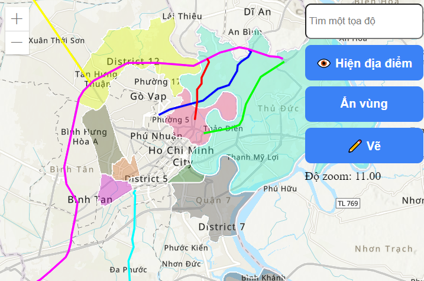

# VNU-UIT - IE402.P11 - Nhóm 6 - Bài thực hành số 1

## Thông tin chung

- Trường Đại học Công nghệ Thông tin, Đại học Quốc gia Thành phố Hồ Chí Minh (ĐHQG-HCM)
- Khoa: Khoa học và Kỹ thuật thông tin (KH&KTTT)
- GVHD: ThS. Phan Thanh Vũ
- Nhóm sinh viên thực hiện: Nhóm 6

## Danh sách sinh viên

| STT |        Họ tên         |   MSSV   |   Chức vụ   |
| :-: | :-------------------: | :------: | :---------: |
|  1  | Nguyễn Thị Hồng Nhung | 21522436 | Nhóm trưởng |
|  2  |  Đặng Huỳnh Vĩnh Tân  | 21520442 | Thành viên  |
|  3  |     Lê Trung Hiếu     | 21520850 | Thành viên  |
|  5  |    Nguyễn Nhật Tấn    | 21521415 | Thành viên  |
|  4  |  Phan Nguyễn Hải Yến  | 21521698 | Thành viên  |
|  6  |   Nguyễn Huy Hoàng    | 21522093 | Thành viên  |

## Mô tả

Trong dự án này, nhóm hiện thực bản đồ vị trí một số quận của [Thành phố Hồ Chí
Minh - Việt Nam](https://vi.wikipedia.org/wiki/Th%C3%A0nh_ph%E1%BB%91_H%E1%BB%93_Ch%C3%AD_Minh), đánh dấu một số thực thể như quận, đường, tòa nhà, công ty,
quán nước,... cùng một số [tính năng](#tính-năng) được xây dựng bên dưới.

## Công cụ sử dụng

- [Visual Studio Code](https://code.visualstudio.com/Download)
- [Live Server](https://marketplace.visualstudio.com/items?itemName=ritwickdey.LiveServer)

## Cách sử dụng

1. Tải repository về máy:
   ```
   git clone https://github.com/NunNunIT/IE402.P11.Group6.Lab
   ```
2. Chuyển sang thư mục dự án:
   ```
   cd ./IE402.P11.Group6.Lab/lab-1
   ```
3. Mở dự án bằng Visual Studio Code
   ```
   code .
   ```

## Chạy dự án

1. Đảm bảo bạn đang sử dụng Visual Studio Code để mở dự án.
2. Mở [index.html](./index.html) bằng Live Server

## Tính năng

Trong dự án này, nhóm xây dụng một số tính năng như:

1. Tìm kiếm vị trí tọa độ trên bản đồ theo định dạng sau:

```
[<Giá trị kinh độ>, Giá trị vĩ độ]
VD: [106.68729295, 10.75351909]
```

2. Ẩn/ Hiện địa điểm đánh dấu trên bản đồ.
3. Ẩn/ Hiện vùng/ quận.
4. Vẽ bản đồ.



## Lưu ý với tính năng **vẽ bản đồ**:

- Sau khi bật chế độ vẽ, ta thực hiện chọn liên tiêp các liên tiếp các điểm trên bản đồ, và giá trị của tọa độ sẽ được lưu trữ vào bộ nhớ tạm theo định dạng

  ```
  [<Giá trị kinh độ 1>, Giá trị vĩ độ 1], [<Giá trị kinh độ 2>, Giá trị vĩ độ 2], ..., [<Giá trị kinh độ n>, Giá trị vĩ độ n],
  ```

- Sử dụng tính năng **dán** hoặc phím tắt `Ctrl + V`, để sử dụng các vị trí tọa độ được lưu.
- Hỗ trợ `Ctrl + Z` để hoàn tác lưu giá trị toạ độ hiện tại.
