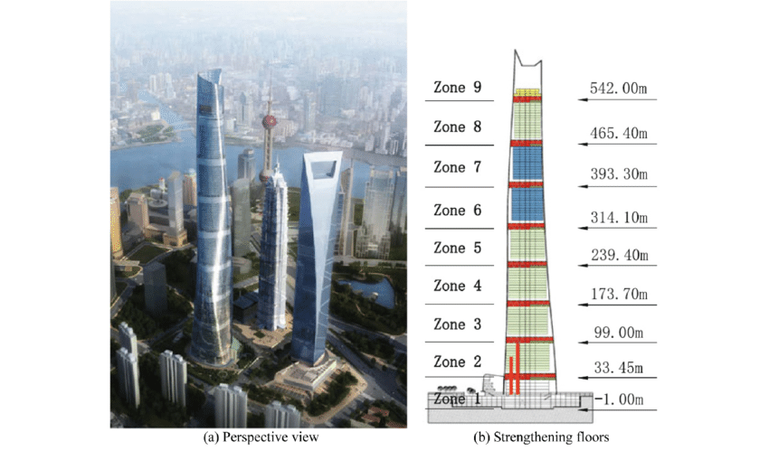
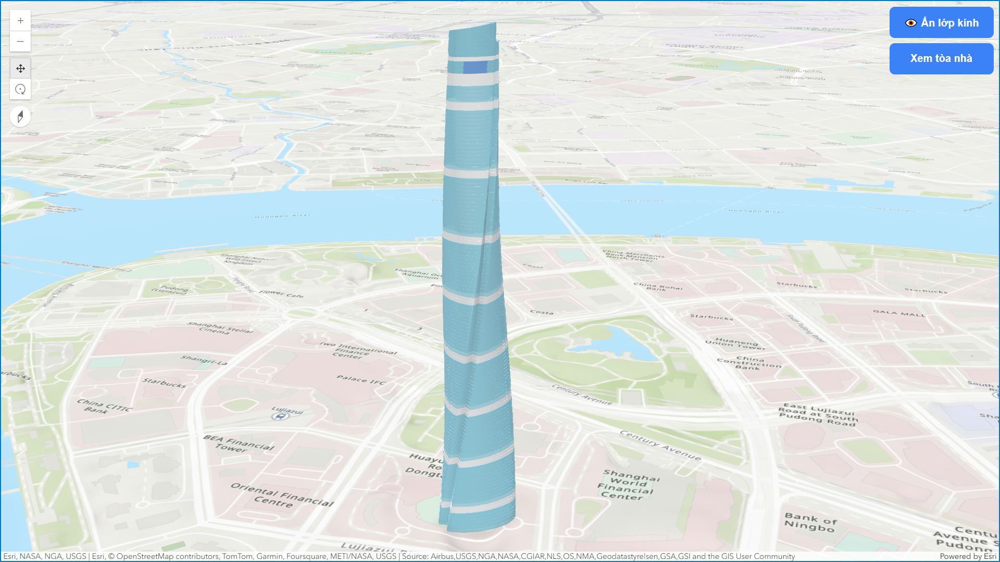
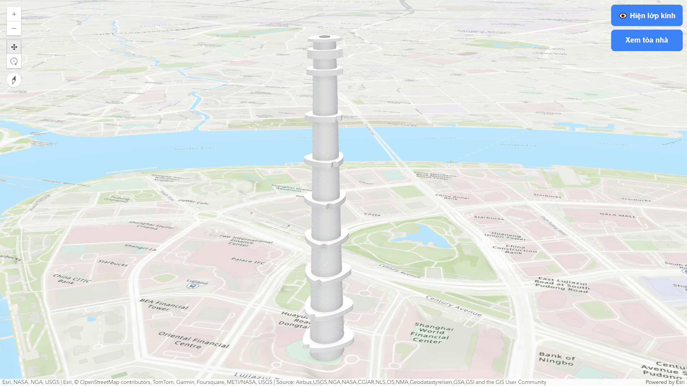
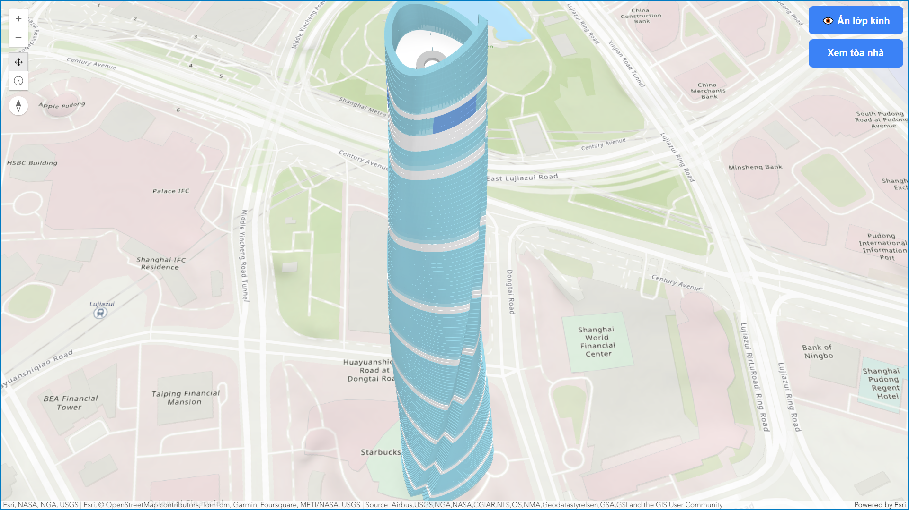
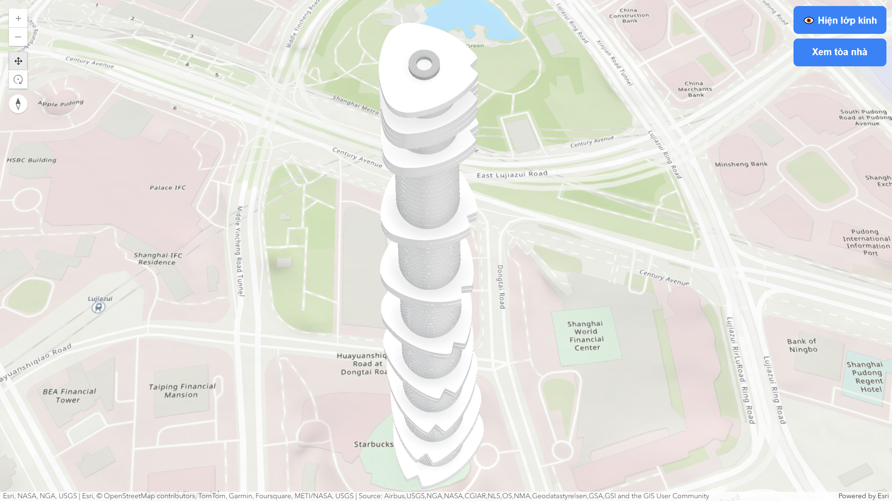

# VNU-UIT - IE402.P11 - Nhóm 6 - Bài thực hành số 2

## Thông tin chung

- Trường Đại học Công nghệ Thông tin, Đại học Quốc gia Thành phố Hồ Chí Minh (ĐHQG-HCM)
- Khoa: Khoa học và Kỹ thuật thông tin (KH&KTTT)
- GVHD: ThS. Phan Thanh Vũ
- Nhóm sinh viên thực hiện: Nhóm 6

## Danh sách sinh viên

| STT |        Họ tên         |   MSSV   |   Chức vụ   |
| :-: | :-------------------: | :------: | :---------: |
|  1  | Nguyễn Thị Hồng Nhung | 21522436 | Nhóm trưởng |
|  2  |  Đặng Huỳnh Vĩnh Tân  | 21520442 | Thành viên  |
|  3  |     Lê Trung Hiếu     | 21520850 | Thành viên  |
|  5  |    Nguyễn Nhật Tấn    | 21521415 | Thành viên  |
|  4  |  Phan Nguyễn Hải Yến  | 21521698 | Thành viên  |
|  6  |   Nguyễn Huy Hoàng    | 21522093 | Thành viên  |

## Mô tả

Trong dự án này, nhóm hiện thực bản đồ 3D Tòa nhà Shanghai China

[Tài liệu Shanghai Tower](https://www.slideshare.net/slideshow/shanghai-tower-facadedesignprocess11102011/31069337?fbclid=IwY2xjawGkJsJleHRuA2FlbQIxMAABHegYGvYl1g-nkjXQGJpM-tVOgiwk8uNEz1b7cyVsbknYI-Y_qHp3sZ5zNw_aem_zHQgI7d4zz-X290iiDCv6A#2)



## Công cụ sử dụng

- [Visual Studio Code](https://code.visualstudio.com/Download)
- [Live Server](https://marketplace.visualstudio.com/items?itemName=ritwickdey.LiveServer)
- Python

## Cách sử dụng

1. Tải repository về máy:
   ```
   git clone https://github.com/NunNunIT/IE402.P11.Group6.Lab
   ```
2. Chuyển sang thư mục dự án:
   ```
   cd ./IE402.P11.Group6.Lab/lab-2
   ```
3. Mở dự án bằng Visual Studio Code
   ```
   code .
   ```

## Chạy dự án

1. Đảm bảo bạn đang sử dụng Visual Studio Code để mở dự án.
2. Mở [index.html](./index.html) bằng Live Server

# Một số hình ảnh





